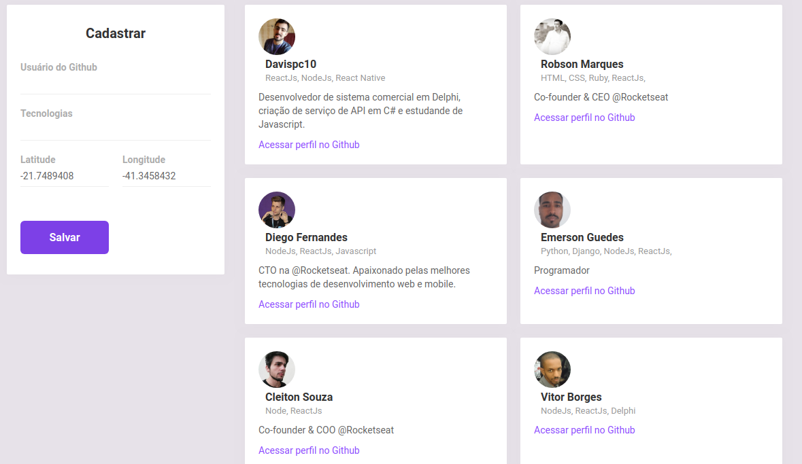
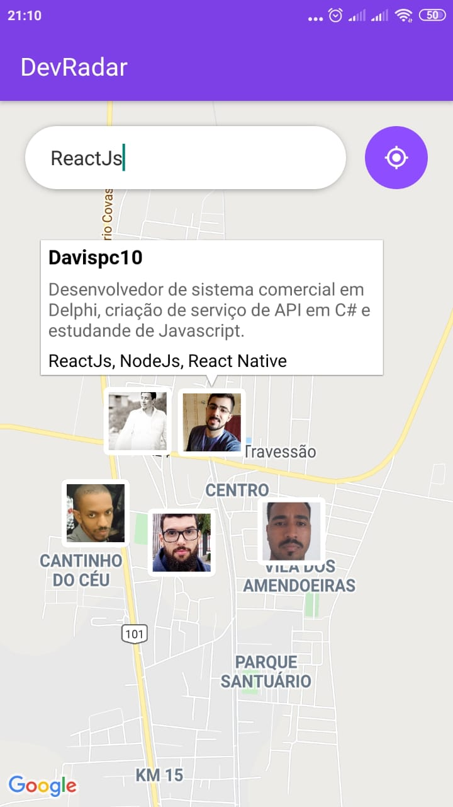

<h1 align="center">
  
<br>
Omnistack 10 - DevRadar
</h1>

<p align="center"> 🚀 DevRadar: Aplicação desenvolvida na 10° semana da Ominstack feito pela Rocketseat.

<p align="center">
  <a href="https://opensource.org/licenses/MIT">
    
  </a>
</p>

## Ferramentas
Foram utilizadas a stack Javascript para o desenvolvimento do projeto:

- ⚛️ **React Js** — Biblioteca JavaScript para construção do frontend da aplicação web;
- ⚛️ **React Native** — Biblioteca que provê uma maneira eficiente de criar aplicações nativas para Android e iOS;
- 💹 **Node Js** — Plataforma que permite utilizar javascript para criar aplicações do lado do servidor(backend).

## Getting started

### Instalação - Backend
Configure o MongoDB e atualize a string de conexão com seu `User:Senha` no caminho `backend/src/index.js`.  
Para instalar as dependências e executar o **Servidor** (modo desenvolvimento), clone o projeto em seu computador e em seguida execute:
```bash
cd backend
yarn install
yarn dev
```

### Instalação - Frontend
Para iniciar o **Frontend** do React utilize os comandos:
```bash
cd web
yarn install
yarn start
```
Assim que o processo terminar, automaticamente será aberta no seu navegador a página `localhost:3000` com a aplicação funcionando.

<h1 align="center"></img></h1>

### Mobile

Para ver a aplicação mobile com o React Native primeiro é necessário colocar o IP do seu servidor (ou computador) no arquivo `src/services/api.js`, e depois executar os comandos:
```bash
# NÃO é preciso executar a linha de baixo caso ja tenha o Expo (CLI) instalado
yarn global add install expo-cli
cd mobile
yarn install
yarn start
```
Assim que o processo terminar, automaticamente será aberta no seu navegador a página `localhost:19002`. Conecte seu emulador, ou teste o aplicativo por `LAN`: baixe o aplicativo **Expo** da Play Store ou App Store e em seguida escaneie o código QR.

<h1 align="center"></img></h1>
<br>

## Licença

Esse projeto é licensiado pela MIT License - Veja a página da [licença](https://opensource.org/licenses/MIT) para detalhes
